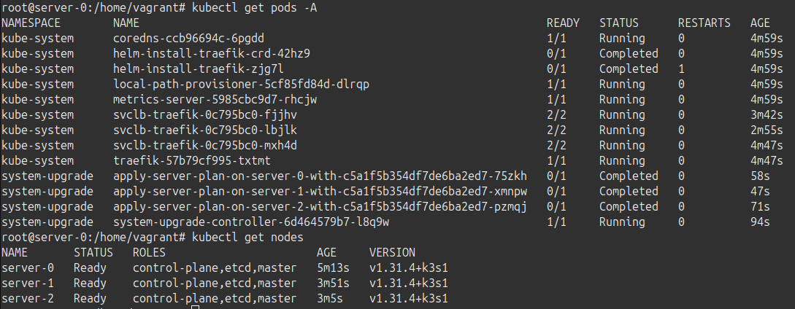

While we have more [detailed docs](/datastore/ha-embedded/) on setting up a High Availability (HA) cluster, this post will cover the simplest HA cluster you can create. 

<!-- truncate -->
## Baseline HA Cluster 💻🖥️💻

Whenever we get a question around HA, this is the cluster configuration I start with. It provides a solid foundation when deploying beyond a single server.

Our cluster will have:
- 4 nodes or VMs:
    - 1 load balancer
    - 3 servers
- A k3s-upgrade plan that will automatically update the cluster to the latest patch version of a given minor.

## Cluster Setup 🌐🔧

I'm using `vagrant` to provision 4 Ubuntu 24.04 VMs for this setup, all on a flat network. Setup of nodes is left as an exercise for the reader 😅.

My nodes are configured with the following names and IPs:
| Name | IP |
|------|----|
| lb-0 | 10.10.10.100 |
| server-0 | 10.10.10.50 |
| server-1 | 10.10.10.51 |
| server-2 | 10.10.10.52 |

### Load Balancer

I'm using [haproxy](https://www.haproxy.org/) as it supports later expansion to multiple LB nodes (via keepalived).

SSH into the load balancer and install haproxy:

```bash
sudo apt install haproxy
```

The haproxy config is simple, just forward traffic to the servers:

```
#/etc/haproxy/haproxy.cfg
frontend k3s
    bind *:6443
    mode tcp
    default_backend k3s

backend k3s
    mode tcp
    option tcp-check
    balance roundrobin
    server server-0 10.10.10.50:6443 check
    server server-1 10.10.10.51:6443 check
    server server-2 10.10.10.52:6443 check
```

Restart haproxy to apply the config:

```bash
systemctl restart haproxy
```

### Install K3s on first server

On the first server, install K3s with embedded etcd and a known token:

```bash
curl -sfL https://get.k3s.io | INSTALL_K3S_CHANNEL=v1.31 sh -s - \
--cluster-init --token k3sblog --tls-san 10.10.10.100
```

We pass the `--tls-san` flag adds the load balancer IP as a Subject Alternative Name (SAN) for the certificate.

### Join the other servers

On the other servers, join the cluster via the load balancer:

```bash
curl -sfL https://get.k3s.io | INSTALL_K3S_CHANNEL=v1.31 sh -s - \
--server https://10.10.10.100:6443 --token k3sblog
```

### Grab the kubeconfig

Now that the cluster is up, we can grab the kubeconfig from the first server:

```bash
scp server-0:/etc/rancher/k3s/k3s.yaml k3s.yaml
```

Modify it to access the cluster via the load balancer:

```bash
sed -i 's/127.0.0.1/10.10.10.100/' k3s.yaml
```

No we can manage the cluster from our local machine:

```bash
export KUBECONFIG=$(pwd)/k3s.yaml
kubectl get nodes
```

## Upgrade Plan 🏗️📝📐

The plan I'm using will keep k3s updated to the latest patch version of the channel we give. In this case I'm using the `v1.31` channel, the same channel used above. Kubernetes v1.31.4 just released at time of writing this post, so with this plan we have stable upgrades handled for the next 10-12 months (depending on how many patch releases this minor gets).

### Install the system-upgrade-controller

The upgrade plan is managed by the system-upgrade-controller. Install it:

```bash
kubectl apply -f https://github.com/rancher/system-upgrade-controller/releases/latest/download/system-upgrade-controller.yaml
kubectl apply -f https://github.com/rancher/system-upgrade-controller/releases/latest/download/crd.yaml
```

### Create the upgrade plan
```yaml
#server-plan.yaml
apiVersion: upgrade.cattle.io/v1
kind: Plan
metadata:
  name: server-plan
  namespace: system-upgrade
spec:
  concurrency: 1
  cordon: true
  nodeSelector:
    matchExpressions:
    - key: node-role.kubernetes.io/control-plane
      operator: In
      values:
      - "true"
  serviceAccountName: system-upgrade
  upgrade:
    image: rancher/k3s-upgrade
  channel: https://update.k3s.io/v1-release/channels/v1.31
```

```bash
kubectl apply -f server-plan.yaml
```

See the [automated upgrade docs](/upgrades/automated) for more details.


## Conclusion 🚀



We now have a high-availability cluster, accessible via a single IP. Upgrades are handled for the next year. This is a great starting point to:
- Add agent nodes to expand our workload capacity
- Add another load-balancer for additional redundancy