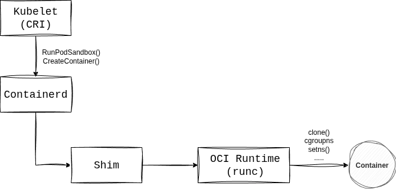

The K3s binary bundles all the components needed to run a production-ready, CNCF-conformant Kubernetes cluster including containerd, runc, kubelet, and more. In this post we will discuss how containerd communicates with OCI runtimes and will discuss adding another container runtime (Sysbox) to K3s and how it can be used to run system pods in your environment.

## Containerd and Runc

First we need to talk briefly about how containerd works with runc. Containerd is a long running daemon that is responsible for:

- **Image Management**: Pulls and stores images from registries.
- **Container Management**: Manages the lifecycle of containers (create, start, stop, delete).
- **Snapshot Management**: Uses snapshotters to manage the filesystem layers for containers.
- **Runtime Management**: Delegates the creation of containers to OCI-compatible runtimes like runc.

When you create a pod in Kubernetes, kubelet uses the CRI plugin implemented in containerd to request a **pod sandbox** (`RunPodSandbox`) and then container creation (`CreateContainer`). Containerd then calls a `shim` process that acts as a middleman between `containerd` and the OCI runtime (for example `runc`). This shim process allows the container to keep running even if the containerd daemon crashes or restarts.  

The shim generates the OCI runtime bundle (`config.json` and `rootfs` path) and then executes the runc binary. Runc reads the `config.json`, sets up the container’s namespaces and cgroups, and then launches the container process.  

Runc is the component that directly interfaces with the Linux kernel — configuring cgroups, namespaces, seccomp, capabilities, and mounts. After runc finishes creating the container, it **exits**, leaving the shim to manage the lifecycle and I/O of the container.



## Sysbox Runtime

[Sysbox](https://github.com/nestybox/sysbox) is an open-source, next-generation container runtime created by Nestybox. Unlike traditional runtimes (such as runc), Sysbox is designed to let you run **system containers**. It primarily leverages **Linux user namespaces** and other features to provide containers that behave more like lightweight virtual machines.  

This means you can run workloads like Docker, Systemd, containerd, or even K3s inside your pods — all without requiring privileged mode.

In short, Sysbox bridges the gap between application containers and virtual machines, enabling use cases like running Kubernetes-in-Kubernetes (K8s-in-K8s), CI/CD pipelines that need full OS-like environments, or development sandboxes with VM-level isolation but container speed.

:::info
Currently, Sysbox officially supports **CRI-O** only. CRI-O has native support for Linux user namespaces, which Sysbox relies on. While containerd added user namespace support starting in version v2.0, there was a [bug](https://github.com/nestybox/sysbox/issues/958) in sysbox-runc that prevented it from working properly with Sysbox.
:::

## Sysbox-runc Containerd Integration

After investigating this issue, I was able to locate the root cause, as explained in this [PR](https://github.com/nestybox/sysbox-runc/pull/106). Containerd was failing to run a specific subcommand for sysbox-runc called `features`, which led to the following error:

```
level=debug msg="failed to introspect features of runtime \"sysbox-runc\"" error="failed to unmarshal Features (*anypb.Any): type with url : not found"
```

Because of this, containerd instructed sysbox-runc to run containers **without user namespaces**, causing container creation to fail. The fix for this bug was recently merged in the `sysbox-runc` repo, enabling containerd to work with sysbox-runc.

# Running Sysbox-runc With K3S

In order to run `sysbox-runc` with K3s you need to have a running K3s cluster, and then you can proceed to install the latest version of sysbox, However, since the fix for containerd support hasn't yet been integrated to sysbox main repo only in `sysbox-runc`, we need to build the binaries from source to get the latest updates.

1. Install docker in your system.

2. Clone the repo and prepare the code

```
git clone --recursive https://github.com/nestybox/sysbox.git

cd sysbox/sysbox-runc

git pull origin main

cd ..

make IMAGE_BASE_DISTRO=ubuntu IMAGE_BASE_RELEASE=jammy sysbox-static
```

You can then copy the binaries built to `/usr/bin` or if you are building on the same machine that you will run containerd you can just run:

```
make install
```

3. Run sysbox binary

```
sysbox
```

4. Create sysbox runc runtime class

```
apiVersion: node.k8s.io/v1
handler: sysbox-runc
kind: RuntimeClass
metadata:
  name: sysbox-runc
```

5. Add sysbox runc to containerd configuration, you can do that by creating `/var/lib/rancher/k3s/agent/etc/containerd/config.toml.tmpl`:

```
[plugins.'io.containerd.cri.v1.runtime'.containerd.runtimes.sysbox-runc]
  runtime_type = "io.containerd.runc.v2"

[plugins.'io.containerd.cri.v1.runtime'.containerd.runtimes.sysbox-runc.options]
  SystemdCgroup = false
  BinaryName="/usr/bin/sysbox-runc"
```

6. Finally you can create pod running with the runtime class for sysbox-runc and `hostUsers: false`:

```
apiVersion: v1
kind: Pod
metadata:
  name: ubuntu
spec:
  runtimeClassName: sysbox-runc
  hostUsers: false
  containers:
  - name: ubuntu2204
    image: ubuntu:22.04
    command: ["sleep", "40000000000"]
  restartPolicy: Never
```

## Conclusion

Sysbox brings a powerful capability to Kubernetes: the ability to run system-level workloads inside containers with strong isolation, without requiring privileged mode. When combined with k3s, this opens the door to new use cases such as:

- Running Kubernetes-in-Kubernetes clusters for virtual clusters (k3k).
- Creating secure developer sandboxes that behave like lightweight VMs.  
- Running system daemons or nested container engines inside pods.  

While Sysbox is officially supported with CRI-O today, the recent fixes in `sysbox-runc` allow it to run on containerd as well — making it possible to integrate with K3s. The integration is still evolving, but it shows how the container ecosystem is moving beyond traditional app containers toward more flexible "system containers."

If you’re experimenting with K3s and want to explore system workloads inside pods, Sysbox provides a compelling way to do so while maintaining Kubernetes-native workflows  