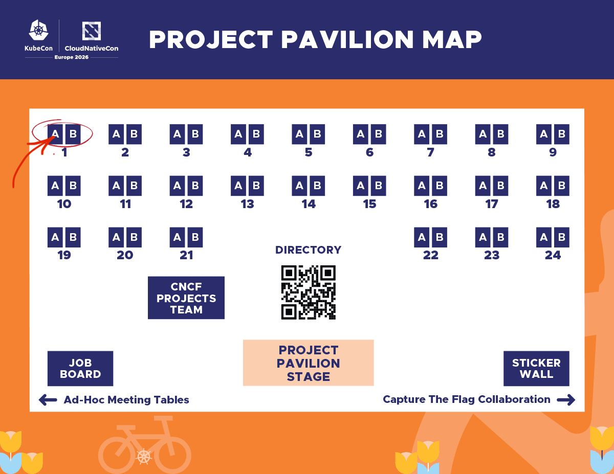

# Project K3s at KubeCon + CloudNativeCon Europe 2026 in Amsterdam

The cloud-native community is heading to Amsterdam for **KubeCon + CloudNativeCon Europe 2026**, and **Project K3s** is excited to be part of the action! As one of the most widely adopted lightweight Kubernetes distributions, K3s continues to empower edge, IoT, and resource-constrained environments across industries.

From satellites to smart farming, K3s is proving that Kubernetes can run anywhere — and this year’s KubeCon is packed with sessions that highlight exactly that.

# K3s at KubeCon Europe 2026

Whether you're a long-time user or just discovering K3s, there are plenty of opportunities to learn, connect, and contribute during the event.

## Lightning Talk

K3s will be featured in a **Lightning Talk**, delivering a fast-paced update on the project and its latest innovations.

**Project Lightning Talk – K3s**  
📅 Monday, March 23, 2026  
🕒 14:22 – 14:27 CET  
📍 Elicium  
🎤 Speaker: Manuel Buil, Maintainer, SUSE

[View session details](https://sched.co/2EFyQ)

Expect a concise overview of how K3s continues to evolve and support modern cloud-native workloads at the edge and beyond.

## 🚨 ContribFest: K3s Session

Want to get hands-on with K3s and contribute to the project? Don’t miss the **K3s ContribFest Session**!

**K3s ContribFest Session**  
📅 Wednesday, March 25, 2026  
🕒 14:15 – 15:30 CET  
📍 Room G107  
🎤 Manuel Buil (SUSE) & Orlin Vasilev (SAP)  

[Join the session](https://sched.co/2EF7m)

This interactive session is perfect for:

- New contributors looking to get started
- Developers interested in K3s internals
- Users who want to give back to the community
- Anyone curious about how open source collaboration works in practice

## K3s in the Wild: Must-See Talks

K3s continues to shine in real-world use cases across edge computing, AI, and distributed systems. Here are some exciting sessions where K3s plays a role:

### 🚀 Edge Computing in Space
**Bringing Cloud Native PaaS to Space: Onboard Edge Computing for Satellites**  
Speakers: Adèle Karam-Hankache & Sergiu Weisz  
[Watch session](https://kccnceu2026.sched.com/event/2CVyc/bringing-cloud-native-paas-to-space-onboard-edge-computing-for-satellites-adele-karam-hankache-thales-alenia-space-sergiu-weisz-politehnica-bucharest?iframe=no&w=100%&sidebar=yes&bg=no)

### 🚜 Kubernetes on Tractors
**Cloud Native at the Farm Edge: Running Kubernetes and AI on Tractors**  
Speakers: Mauro Morales & Jordan Karapanagiotis  
[Watch session](https://kccnceu2026.sched.com/event/2CW75/cloud-native-at-the-farm-edge-running-kubernetes-and-ai-on-tractors-mauro-morales-spectro-cloud-jordan-karapanagiotis-aurea-imaging?iframe=no&w=100%&sidebar=yes&bg=no)

### 🏰 Multi-Tenancy & Isolation
**Three Shades of Isolation: A Multi-Tenancy Fortress**  
Speakers: Braulio Dumba & Paolo Dettori  
[Watch session](https://kccnceu2026.sched.com/event/2CW7T/three-shades-of-isolation-a-multi-tenancy-fortress-braulio-dumba-paolo-dettori-ibm?iframe=no&w=100%&sidebar=yes&bg=no)

### ⚙️ Platform Engineering Evolution
**Platform Engineering 2.0: Just Enough Kubernetes and AI-Native DevOps**  
Speaker: Shweta Vohra  
[Watch session](https://kccnceu2026.sched.com/event/2CW80/platform-engineering-20-just-enough-kubernetes-and-ai-native-devops-shweta-vohra-bookingcom?iframe=no&w=100%&sidebar=yes&bg=no)

These talks showcase how K3s is enabling innovation in environments where traditional Kubernetes would be too heavy or complex.

## Panel Discussion

K3s is also represented in broader CNCF conversations around security and project sustainability.

**Strengthening CNCF Projects: Impact of Security Self-Assessments**  
🎤 Featuring Orlin Vasilev and other industry experts  

[View panel details](https://kccnceu2026.sched.com/event/2EF6x/strengthening-cncf-projects-impact-of-security-self-assessments-eddie-knight-sonatype-bradley-andersen-k8gb-justin-cappos-new-york-university-shuting-zhao-nirmata-orlin-vasilev-suse?iframe=no&w=100%&sidebar=yes&bg=no)

This panel dives into how CNCF projects, including K3s, are improving security practices and building trust across the ecosystem.

### Find K3s at the Project Pavilion

Stop by the K3s kiosk at **booth P-1A** during the following times:

**Wednesday:** 10:00 – 13:30  
**Thursday:** 10:00 – 12:00  

Come chat with contributors, ask questions, and learn more about K3s in real-world use cases!

Don’t forget to explore the **Project Pavilion**, where CNCF projects come together to showcase their work and connect with the community.

Learn more:  
https://events.linuxfoundation.org/kubecon-cloudnativecon-europe/features-add-ons/project-engagement/

While K3s may appear across multiple booths and partner ecosystems, this is the perfect place to:

- Meet contributors and maintainers
- Discover integrations and real-world use cases
- Ask questions about running K3s in production
- Explore ways to get involved

## Join the K3s Community

K3s has grown into one of the most impactful Kubernetes distributions thanks to its vibrant and welcoming community. Whether you're running clusters at the edge, in the cloud, or somewhere entirely unexpected — there’s a place for you in the K3s ecosystem.

KubeCon is the perfect opportunity to:

- Meet fellow K3s users and contributors
- Share your use cases and experiences
- Learn from real-world deployments
- Start contributing to the project

## See You in Amsterdam!

We’re excited to connect with the global cloud-native community and showcase how K3s continues to push the boundaries of Kubernetes.

If you're passionate about **edge computing, lightweight Kubernetes, and open source collaboration**, don’t miss the K3s sessions at KubeCon Europe 2026.

**See you in Amsterdam!**

[*For more details and to register for KubeCon + CloudNativeCon Europe 2026, visit the official event page.*](https://events.linuxfoundation.org/kubecon-cloudnativecon-europe/)

 
 

[Orlin Vasilev](https://www.linkedin.com/in/orlinvasilev/)  
K3s Community Manager