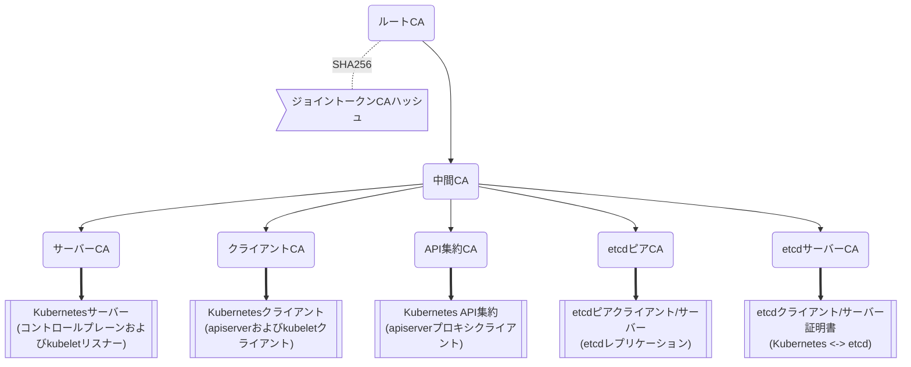
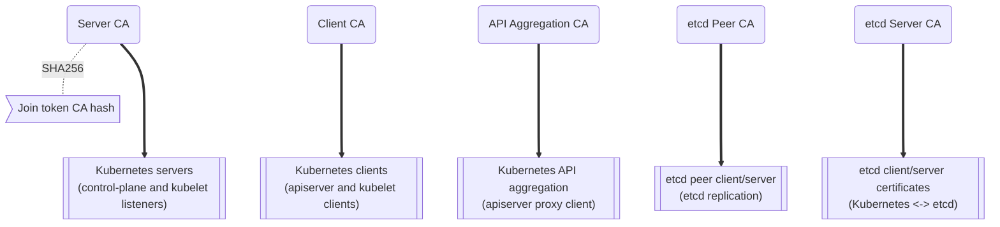
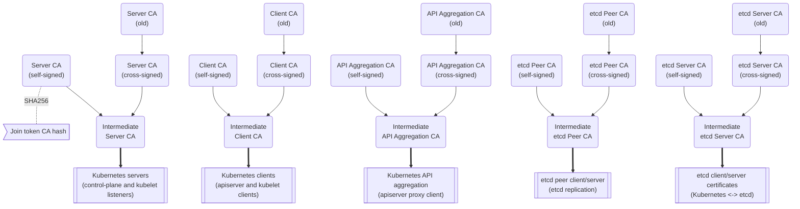

# k3s 証明書

## クライアントおよびサーバー証明書

K3sのクライアントおよびサーバー証明書は、発行日から365日間有効です。期限切れの証明書や、期限切れまで90日以内の証明書は、K3sが起動するたびに自動的に更新されます。

### クライアントおよびサーバー証明書のローテーション

クライアントおよびサーバー証明書を手動でローテーションするには、`k3s certificate rotate`サブコマンドを使用します：

```bash
# K3sを停止
systemctl stop k3s

# 証明書をローテーション
k3s certificate rotate

# K3sを起動
systemctl start k3s
```

証明書の名前を指定することで、個別またはリストの証明書をローテーションできます：

```bash
k3s certificate rotate --service <SERVICE>,<SERVICE>
```

以下の証明書がローテーション可能です：`admin`, `api-server`, `controller-manager`, `scheduler`, `k3s-controller`, `k3s-server`, `cloud-controller`, `etcd`, `auth-proxy`, `kubelet`, `kube-proxy`。

## 証明書認証局 (CA) 証明書

Kubernetesの適切な動作には、いくつかのCA証明書が必要です。KubernetesがCA証明書をどのように使用するかについての詳細は、Kubernetesの[PKI証明書と要件](https://kubernetes.io/docs/setup/best-practices/certificates/#all-certificates)ドキュメントを参照してください。

デフォルトでは、K3sは最初のサーバーノードの起動時に自己署名のCA証明書を生成します。これらのCA証明書は発行日から10年間有効で、自動的に更新されません。

権威あるCA証明書とキーは、データストアのブートストラップキー内に保存され、[サーバートークン](token.md#server)をPBKDF2パスフレーズとして使用してAES256-GCMおよびHMAC-SHA1で暗号化されます。
CA証明書とキーのコピーは、K3sサーバーの起動時にディスクに抽出されます。
任意のサーバーは、クラスターに参加するノードのリーフ証明書を生成でき、Kubernetesの[証明書API](https://kubernetes.io/docs/reference/access-authn-authz/certificate-signing-requests/)コントローラーはランタイムで追加の証明書を発行することができます。

CA証明書とキーをローテーションするには、`k3s certificate rotate-ca`コマンドを使用します。
このコマンドは、更新された証明書とキーが使用可能であることを確認するための整合性チェックを実行します。
更新されたデータが受け入れ可能であれば、データストアの暗号化されたブートストラップキーが更新され、次回K3sが起動する際に新しい証明書とキーが使用されます。
証明書とキーの検証中に問題が発生した場合、システムログにエラーが報告され、操作は変更なしでキャンセルされます。

:::info バージョンゲート
`k3s certificate rotate-ca`コマンドのサポートおよび外部CAによって署名されたCA証明書の使用は、2023-02リリース（v1.26.2+k3s1、v1.25.7+k3s1、v1.24.11+k3s1、v1.23.17+k3s1）から利用可能です。
:::

### カスタムCA証明書の使用

クラスターの最初のサーバーの初回起動時に正しい場所にCA証明書とキーが見つかった場合、CA証明書の自動生成はバイパスされます。

適切な証明書とキーを事前に作成するためのサンプルスクリプトは、[K3sリポジトリの`contrib/util/generate-custom-ca-certs.sh`](https://github.com/k3s-io/k3s/blob/master/contrib/util/generate-custom-ca-certs.sh)にあります。
このスクリプトは、K3sを初めて起動する前に実行する必要があり、共通のルートおよび中間CA証明書によって署名された完全なリーフCA証明書セットを作成します。
既存のルートまたは中間CAがある場合、このスクリプトを使用して（または開始点として使用して）既存の権限にルート化されたPKIを持つK3sクラスターをプロビジョニングするための正しいCA証明書を作成できます。

カスタム証明書認証局ファイルは`/var/lib/rancher/k3s/server/tls`に配置する必要があります。以下のファイルが必要です：
* `server-ca.crt`
* `server-ca.key`
* `client-ca.crt`
* `client-ca.key`
* `request-header-ca.crt`
* `request-header-ca.key`  
  *// 注：etcdファイルは、埋め込みetcdが使用されていない場合でも必要です。*
* `etcd/peer-ca.crt`  
* `etcd/peer-ca.key`
* `etcd/server-ca.crt`
* `etcd/server-ca.key`  
  *// 注：これはサービスアカウントトークンに署名するために使用される秘密鍵です。対応する証明書はありません。*
* `service.key`

#### カスタムCAトポロジー

カスタムCA証明書は、以下のトポロジーに従う必要があります：



#### サンプルスクリプトの使用

:::info 重要
サンプルスクリプトを使用して既存のルートCAでクラスターCA証明書に署名する場合、スクリプトを実行する前にターゲットディレクトリにルートおよび中間ファイルを配置する必要があります。
ファイルが存在しない場合、スクリプトは新しいルートおよび中間CA証明書を作成します。
:::

既存のルートCA証明書のみを使用する場合、以下のファイルを提供してください：
* `root-ca.pem`
* `root-ca.key`

既存のルートおよび中間CA証明書を使用する場合、以下のファイルを提供してください：
* `root-ca.pem`
* `intermediate-ca.pem`
* `intermediate-ca.key`

K3sを起動する前にカスタム証明書とキーを生成するためにサンプルスクリプトを使用するには、以下のコマンドを実行します：
```bash
# 証明書生成のためのターゲットディレクトリを作成
mkdir -p /var/lib/rancher/k3s/server/tls

# ルートCA証明書と中間CA証明書+キーをスクリプトの正しい場所にコピー
# この例では、既存のルートおよび中間CAファイルが/etc/sslにあると仮定します。
# 既存のルートおよび/または中間CAがない場合、スクリプトはそれらを生成します。
cp /etc/ssl/certs/root-ca.pem /etc/ssl/certs/intermediate-ca.pem /etc/ssl/private/intermediate-ca.key /var/lib/rancher/k3s/server/tls

# カスタムCA証明書とキーを生成
curl -sL https://github.com/k3s-io/k3s/raw/master/contrib/util/generate-custom-ca-certs.sh | bash -
```

コマンドが正常に完了した場合、K3sを初めてインストールおよび/または起動できます。
スクリプトがルートおよび/または中間CAファイルを生成した場合、これらのファイルをバックアップして、後でCA証明書をローテーションする必要がある場合に再利用できるようにしてください。

### カスタムCA証明書のローテーション

カスタムCA証明書をローテーションするには、`k3s certificate rotate-ca`サブコマンドを使用します。
更新されたファイルは一時ディレクトリにステージングされ、データストアにロードされ、更新された証明書を使用するためにすべてのノードでk3sを再起動する必要があります。

:::warning
現在使用中のデータを`/var/lib/rancher/k3s/server/tls`に上書きしてはいけません。  
更新された証明書とキーを別のディレクトリにステージングしてください。
:::

カスタムCA証明書で起動されたクラスターは、同じルートCAを使用する限り、CA証明書とキーを非破壊的に更新またはローテーションできます。

新しいルートCAが必要な場合、ローテーションは破壊的になります。`k3s certificate rotate-ca --force`オプションを使用する必要があり、[セキュアトークン](token.md#secure)で参加したすべてのノード（サーバーを含む）は、新しいトークン値を使用するように再構成する必要があり、ポッドは新しいルートCAを信頼するために再起動する必要があります。

#### サンプルスクリプトの使用

上記のサンプル`generate-custom-ca-certs.sh`スクリプトは、ファイルを正しい場所にコピーし、`DATA_DIR`環境変数を設定することで、新しい一時ディレクトリで更新された証明書を生成するためにも使用できます。
更新された証明書とキーを生成するためにサンプルスクリプトを使用するには、以下のコマンドを実行します：
```bash
# 証明書生成のための一時ディレクトリを作成
mkdir -p /opt/k3s/server/tls

# ルートCA証明書と中間CA証明書+キーをスクリプトの正しい場所にコピー
# 非破壊的なローテーションには、元の証明書を生成したルートCAが必要です。
# 元のファイルがデータディレクトリにまだある場合、次のコマンドを実行できます：
cp /var/lib/rancher/k3s/server/tls/root-ca.* /var/lib/rancher/k3s/server/tls/intermediate-ca.* /opt/k3s/server/tls

# 現在のサービスアカウント署名キーをコピーし、既存のサービスアカウントトークンが無効にならないようにします。
cp /var/lib/rancher/k3s/server/tls/service.key /opt/k3s/server/tls

# 更新されたカスタムCA証明書とキーを生成
curl -sL https://github.com/k3s-io/k3s/raw/master/contrib/util/generate-custom-ca-certs.sh | DATA_DIR=/opt/k3s bash -

# 更新されたCA証明書とキーをデータストアにロード
k3s certificate rotate-ca --path=/opt/k3s/server
```

`rotate-ca`コマンドがエラーを返した場合、サービスログでエラーを確認してください。
コマンドが正常に完了した場合、クラスター内のすべてのノードでK3sを再起動します - まずサーバー、次にエージェント。

`--force`オプションを使用した場合やルートCAを変更した場合、[セキュアトークン](token.md#secure)で参加したノードが再起動される前に、新しいトークン値を使用するように再構成されていることを確認してください。
トークンは、.envファイル、systemdユニット、またはconfig.yamlに保存されている場合があります。これは、初回インストール時にノードがどのように構成されたかによります。

### 自己署名CA証明書のローテーション

K3sが生成した自己署名CA証明書をローテーションするには、`k3s certificate rotate-ca`サブコマンドを使用します。
更新されたファイルは一時ディレクトリにステージングされ、データストアにロードされ、更新された証明書を使用するためにすべてのノードでk3sを再起動する必要があります。

:::warning
現在使用中のデータを`/var/lib/rancher/k3s/server/tls`に上書きしてはいけません。  
更新された証明書とキーを別のディレクトリにステージングしてください。
:::


クラスタがデフォルトの自己署名CA証明書で開始された場合、ローテーションは中断を引き起こします。[セキュアトークン](token.md#secure)で参加したすべてのノードは、新しいCAハッシュを信頼するように再構成する必要があります。
新しいCA証明書が古いCA証明書によってクロス署名されていない場合、整合性チェックをバイパスするために`--force`オプションを使用する必要があり、ポッドは新しいルートCAを信頼するために再起動する必要があります。

#### デフォルトCAトポロジー
デフォルトの自己署名CA証明書は以下のトポロジーを持っています：



デフォルトの自己署名CAをローテーションする際には、中間CAと古いCAによってクロス署名された新しいルートCAを使用する修正された証明書トポロジーを使用することで、古いCAと新しいCAの間に連続した信頼のチェーンを確保できます：


#### サンプルスクリプトの使用

既存のCAによってクロス署名された更新されたCA証明書とキーを作成するためのサンプルスクリプトは、[K3sリポジトリの`contrib/util/rotate-default-ca-certs.sh`](https://github.com/k3s-io/k3s/blob/master/contrib/util/rotate-default-ca-certs.sh)にあります。

既存のCAによってクロス署名された更新された自己署名証明書を生成するためにサンプルスクリプトを使用するには、以下のコマンドを実行します：
```bash
# 現在のCAによってクロス署名された更新されたCA証明書とキーを作成します。
# このスクリプトは更新された証明書を含む新しい一時ディレクトリを作成し、新しいトークン値を出力します。
curl -sL https://github.com/k3s-io/k3s/raw/master/contrib/util/rotate-default-ca-certs.sh | bash -

# 更新された証明書をデータストアにロードします。スクリプトの出力で更新されたトークン値を確認してください。
k3s certificate rotate-ca --path=/var/lib/rancher/k3s/server/rotate-ca
```

`rotate-ca`コマンドがエラーを返した場合、サービスログでエラーを確認してください。
コマンドが正常に完了した場合、クラスタ内のすべてのノードでK3sを再起動します - まずサーバー、次にエージェント。

[セキュアトークン](token.md#secure)で参加した他のサーバーノードを含むすべてのノードが、新しいトークン値を使用するように再構成されてから再起動されることを確認してください。
トークンは、初期インストール時のノードの構成方法に応じて、`.env`ファイル、systemdユニット、またはconfig.yamlに保存されている場合があります。

## サービスアカウント発行者キーのローテーション

サービスアカウント発行者キーは、サービスアカウントトークンに署名するために使用されるRSA秘密鍵です。
サービスアカウント発行者キーをローテーションする際には、既存のサービスアカウントトークンが無効にならないように、少なくとも1つの古いキーをファイルに保持する必要があります。
`k3s certificate rotate-ca`を使用して、新しい`service.key`ファイルをインストールすることで、クラスタCAとは独立してローテーションできます。

:::warning
`/var/lib/rancher/k3s/server/tls`の現在使用中のデータを上書きしてはいけません。  
更新されたキーを別のディレクトリにステージングしてください。
:::

例えば、サービスアカウント発行者キーのみをローテーションするには、以下のコマンドを実行します：
```bash
# 証明書生成のための一時ディレクトリを作成
mkdir -p /opt/k3s/server/tls

# OpenSSLバージョンを確認
openssl version | grep -qF 'OpenSSL 3' && OPENSSL_GENRSA_FLAGS=-traditional

# 新しいキーを生成
openssl genrsa ${OPENSSL_GENRSA_FLAGS:-} -out /opt/k3s/server/tls/service.key 2048

# 現在のトークンを無効にしないように既存のキーを追加
cat /var/lib/rancher/k3s/server/tls/service.key >> /opt/k3s/server/tls/service.key

# 更新されたキーをデータストアにロード
k3s certificate rotate-ca --path=/opt/k3s/server
```

更新されていないファイルに対する警告が表示されるのは正常です。`rotate-ca`コマンドがエラーを返した場合、サービスログでエラーを確認してください。
コマンドが正常に完了した場合、クラスタ内のすべてのサーバーでK3sを再起動します。エージェントやポッドを再起動する必要はありません。