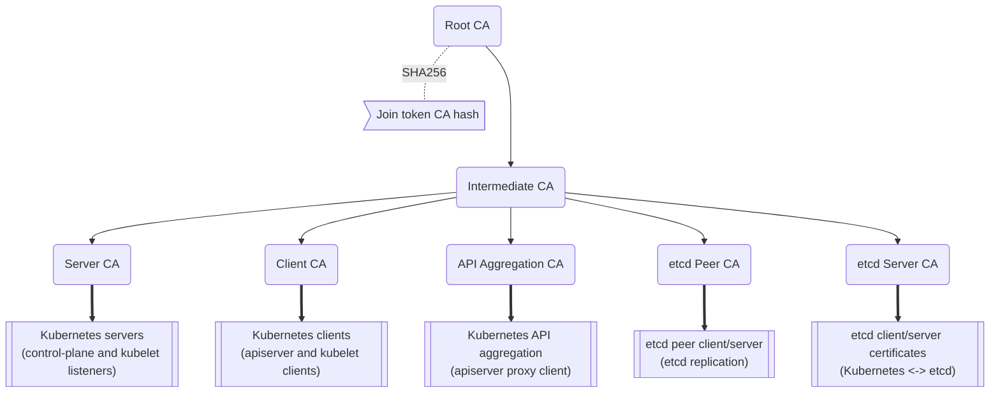
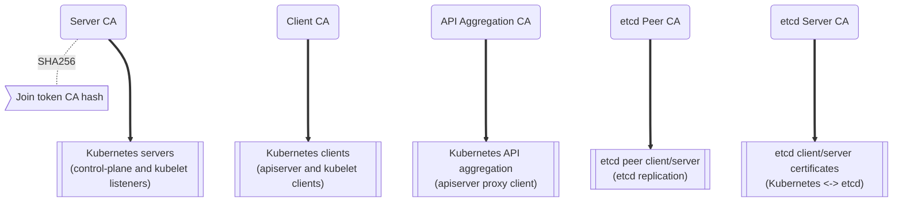
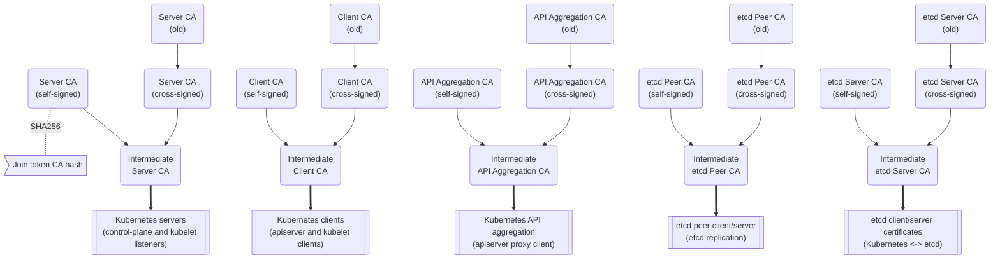

# K3s Certificado

## Certificados de Cliente e Servidor

Os certificados de cliente e servidor do K3s são válidos por 365 dias a partir da data de emissão. Quaisquer certificados que estejam expirados, ou dentro de 90 dias de expiração, são renovados automaticamente toda vez que o K3s é iniciado.

### Certificados de Cliente e Servidor Rotativos

Para rotacionar certificados de cliente e servidor manualmente, use o subcomando `k3s certificate rotate`:

```bash
# Para K3s
systemctl stop k3s

# Rotaciona certificados
k3s certificate rotate

# Inicializa K3s
systemctl start k3s
```

Certificados individuais ou listas de certificados podem ser rotacionados especificando o nome do certificado:

```bash
k3s certificate rotate --service <SERVICE>,<SERVICE>
```

Os seguintes certificados podem ser rotacionados: `admin`, `api-server`, `controller-manager`, `scheduler`, `k3s-controller`, `k3s-server`, `cloud-controller`, `etcd`, `auth-proxy`, `kubelet`, `kube-proxy`.

## Certificados de Autoridade Certificadora (CA)

O Kubernetes requer uma série de certificados CA para operação adequada. Para obter mais informações sobre como o Kubernetes usa certificados CA, consulte a documentação do Kubernetes [Certificados e requisitos de PKI](https://kubernetes.io/docs/setup/best-practices/certificates/#all-certificates).

Por padrão, o K3s gera certificados CA autoassinados durante a inicialização do primeiro nó do servidor. Esses certificados CA são válidos por 10 anos a partir da data de emissão e não são renovados automaticamente.

Os certificados e chaves de CA autoritativos são armazenados na chave de bootstrap do armazenamento de dados, criptografados usando o [token do servidor](token.md#server) como a senha PBKDF2 com AES256-GCM e HMAC-SHA1.
Cópias dos certificados e chaves da CA são extraídas para o disco durante a inicialização do servidor K3s.
Qualquer servidor pode gerar certificados folha para nós à medida que eles se juntam ao cluster, e os controladores do Kubernetes [API de certificados](https://kubernetes.io/docs/reference/access-authn-authz/certificate-signing-requests/) podem emitir certificados adicionais em tempo de execução.

Para rotacionar certificados e chaves de CA, use o comando `k3s certificate rotate-ca`.
O comando executa verificações de integridade para confirmar que os certificados e chaves atualizados são utilizáveis.
Se os dados atualizados forem aceitáveis, a chave de bootstrap criptografada do datastore será atualizada, e os novos certificados e chaves serão usados ​​na próxima vez que o K3s for iniciado.
Se forem encontrados problemas durante a validação dos certificados e chaves, um erro será relatado ao log do sistema e a operação será cancelada sem alterações.

:::info Nota de Versão
O suporte para o comando `k3s certificate rotate-ca` e a capacidade de usar certificados de CA assinados por uma CA externa estão disponíveis a partir das versões 2023-02 (v1.26.2+k3s1, v1.25.7+k3s1, v1.24.11+k3s1, v1.23.17+k3s1).
:::

### Usando Certificados CA Customizados

Se os certificados e chaves da CA forem encontrados no local correto durante a inicialização do primeiro servidor no cluster, a geração automática de certificados da CA será ignorada.

Um script de exemplo para pré-criar os certificados e chaves apropriados está disponível [no repositório K3s em `contrib/util/generate-custom-ca-certs.sh`](https://github.com/k3s-io/k3s/blob/master/contrib/util/generate-custom-ca-certs.sh).
Este script deve ser executado antes de iniciar o K3s pela primeira vez e criará um conjunto completo de certificados CA folha assinados por certificados CA raiz e intermediário comuns.
Se você tiver uma CA raiz ou intermediária existente, este script pode ser usado (ou usado como um ponto de partida) para criar os certificados CA corretos para provisionar um cluster K3s com PKI enraizada em uma autoridade existente.

Arquivos de Autoridade de Certificação Personalizados devem ser colocados em `/var/lib/rancher/k3s/server/tls`. Os seguintes arquivos são necessários:
* `server-ca.crt`
* `server-ca.key`
* `client-ca.crt`
* `client-ca.key`
* `request-header-ca.crt`
* `request-header-ca.key`
  *// nota: arquivos etcd são necessários mesmo se o etcd incorporado não estiver em uso.*
* `etcd/peer-ca.crt`
* `etcd/peer-ca.key`
* `etcd/server-ca.crt`
* `etcd/server-ca.key`
  *// nota: Esta é a chave privada usada para assinar tokens de conta de serviço. Ela não tem um certificado correspondente.*
* `service.key`

#### Topologia CA Customizada

Os certificados CA customizados devem observar a seguinte topologia:



#### Usando o Script de Exemplo

:::info Importante
Se você quiser assinar os certificados de CA do cluster com uma CA raiz existente usando o script de exemplo, você deve colocar os arquivos raiz e intermediários no diretório de destino antes de executar o script.
Se os arquivos não existirem, o script criará novos certificados de CA raiz e intermediários.
:::

Se você quiser usar apenas um certificado de CA raiz existente, forneça os seguintes arquivos:
* `root-ca.pem`
* `root-ca.key`

Se você quiser usar certificados de CA raiz e intermediários existentes, forneça os seguintes arquivos:
* `root-ca.pem`
* `intermediate-ca.pem`
* `intermediate-ca.key`

Para usar o script de exemplo para gerar certificados e chaves personalizados antes de iniciar o K3s, execute os seguintes comandos:
```bash
# Crie o diretório de destino para geração de certificado.
mkdir -p /var/lib/rancher/k3s/server/tls

# Copie seu certificado CA raiz e o certificado CA intermediário+chave no local correto para o script.
# Para os propósitos deste exemplo, assumimos que você tem arquivos CA raiz e intermediário existentes em /etc/ssl.
# Se você não tiver um CA raiz e/ou intermediário existente, o script irá gerá-los para você.
cp /etc/ssl/certs/root-ca.pem /etc/ssl/certs/intermediate-ca.pem /etc/ssl/private/intermediate-ca.key /var/lib/rancher/k3s/server/tls

# Gere certificados e chaves de CA personalizados.
curl -sL https://github.com/k3s-io/k3s/raw/master/contrib/util/generate-custom-ca-certs.sh | bash -
```

Se o comando for concluído com sucesso, você pode instalar e/ou iniciar o K3s pela primeira vez.
Se o script gerou arquivos CA raiz e/ou intermediários, você deve fazer backup desses arquivos para que eles possam ser reutilizados se for necessário rotacionar os certificados CA posteriormente.

### Rotacionando Certificados CA Customizados

Para rotacionar certificados CA personalizados, use o subcomando `k3s certificate rotate-ca`.
Os arquivos atualizados devem ser preparados em um diretório temporário, carregados no datastore e o k3s deve ser reiniciado em todos os nós para usar os certificados atualizados.

:::warning
Você não deve sobrescrever os dados em uso no momento em `/var/lib/rancher/k3s/server/tls`.
Coloque os certificados e chaves atualizados em um diretório separado.
:::

Um cluster que foi iniciado com certificados de CA personalizados pode renovar ou rotacionar os certificados e chaves de CA sem interrupções, desde que a mesma CA raiz seja usada.

Se uma nova CA raiz for necessária, a rotação será disruptiva. A opção `k3s certificate rotate-ca --force` deve ser usada, todos os nós que foram unidos com um [token seguro](token.md#secure) (incluindo servidores) precisarão ser reconfigurados para usar o novo valor de token, e os pods precisarão ser reiniciados para confiar na nova CA raiz.

#### Usando o Script de Exemplo

O script de exemplo `generate-custom-ca-certs.sh` vinculado acima também pode ser usado para gerar certificados atualizados em um novo diretório temporário, copiando arquivos para o local correto e definindo a variável de ambiente `DATA_DIR`.
Para usar o script de exemplo para gerar certificados e chaves atualizados, execute os seguintes comandos:
```bash
# Crie um diretório temporário para geração de certificado.
mkdir -p /opt/k3s/server/tls

# Copie seu certificado CA raiz e o certificado CA intermediário+chave no local correto para o script.
# A rotação não disruptiva requer o mesmo CA raiz que foi usado para gerar os certificados originais.
# Se os arquivos originais ainda estiverem no diretório de dados, você pode simplesmente executar:
cp /var/lib/rancher/k3s/server/tls/root-ca.* /var/lib/rancher/k3s/server/tls/intermediate-ca.* /opt/k3s/server/tls

# Copie a chave de assinatura da conta de serviço atual para que os tokens de conta de serviço existentes não sejam invalidados.
cp /var/lib/rancher/k3s/server/tls/service.key /opt/k3s/server/tls

# Gere certificados e chaves de CA personalizados e atualizados.
curl -sL https://github.com/k3s-io/k3s/raw/master/contrib/util/generate-custom-ca-certs.sh | DATA_DIR=/opt/k3s bash -

# Carregue os certificados e chaves de CA atualizados no armazenamento de dados.
k3s certificate rotate-ca --path=/opt/k3s/server
```

Se o comando `rotate-ca` retornar um erro, verifique o log de serviço para erros.
Se o comando for concluído com sucesso, reinicie o K3s em todos os nós no cluster - servidores primeiro, depois agentes.

Se você usou a opção `--force` ou alterou a CA raiz, certifique-se de que todos os nós que foram unidos com um [token seguro](token.md#secure) sejam reconfigurados para usar o novo valor de token, antes de serem reiniciados.
O token pode ser armazenado em um arquivo `.env`, unidade systemd ou config.yaml, dependendo de como o nó foi configurado durante a instalação inicial.

### Rotacionando Certificados CA Autoassinados

Para rotacionar os certificados CA autoassinados gerados pelo K3s, use o subcomando `k3s certificate rotate-ca`.
Os arquivos atualizados devem ser preparados em um diretório temporário, carregados no datastore e o k3s deve ser reiniciado em todos os nós para usar os certificados atualizados.

:::warning
Você não deve sobrescrever os dados em uso no momento em `/var/lib/rancher/k3s/server/tls`.
Coloque os certificados e chaves atualizados em um diretório separado.
:::

Se o cluster tiver sido iniciado com certificados CA autoassinados padrão, a rotação será disruptiva. Todos os nós que foram unidos com um [token seguro](token.md#secure) precisarão ser reconfigurados para confiar no novo hash CA.
Se os novos certificados CA não forem assinados de forma cruzada pelos antigos certificados CA, você precisará usar a opção `--force` para ignorar as verificações de integridade, e os pods precisarão ser reiniciados para confiar no novo CA raiz.

#### Topologia CA Padrão
Os certificados CA autoassinados padrão têm a seguinte topologia:



Ao rotacionar as CAs autoassinadas padrão, uma topologia de certificado modificada com CAs intermediárias e uma nova CA raiz assinada pela CA antiga pode ser usada para que haja uma cadeia contínua de confiança entre as CAs antigas e novas:


#### Usando o Script de Exemplo

Um script de exemplo para criar certificados CA atualizados e chaves assinadas cruzadamente pelas CAs existentes está disponível [no repositório K3s em `contrib/util/rotate-default-ca-certs.sh`](https://github.com/k3s-io/k3s/blob/master/contrib/util/rotate-default-ca-certs.sh).

Para usar o script de exemplo para gerar certificados autoassinados atualizados que são assinados de forma cruzada pelas CAs existentes, execute os seguintes comandos:
```bash
# Crie certificados e chaves CA atualizados, assinados de forma cruzada pelos CAs atuais.
# Este script criará um novo diretório temporário contendo os certificados atualizados e produzirá os novos valores de token.
curl -sL https://github.com/k3s-io/k3s/raw/master/contrib/util/rotate-default-ca-certs.sh | bash -

# Carregue os certificados atualizados no armazenamento de dados; veja a saída do script para os valores de token atualizados.
k3s certificate rotate-ca --path=/var/lib/rancher/k3s/server/rotate-ca
```

Se o comando `rotate-ca` retornar um erro, verifique se há erros no log de serviço.
Se o comando for concluído com sucesso, reinicie o K3s em todos os nós do cluster - servidores primeiro, depois agentes.

Certifique-se de que todos os nós que foram unidos com um [token seguro](token.md#secure), incluindo outros nós de servidor, sejam reconfigurados para usar o novo valor de token antes de serem reiniciados.
O token pode ser armazenado em um arquivo `.env`, unidade systemd ou config.yaml, dependendo de como o nó foi configurado durante a instalação inicial.

## Rotação de Chaves do Emissor da Conta de Serviço

A chave do emissor da conta de serviço é uma chave privada RSA usada para assinar tokens de conta de serviço.
Ao rotacionar a chave do emissor da conta de serviço, pelo menos uma chave antiga deve ser mantida no arquivo para que os tokens de conta de serviço existentes não sejam invalidados.
Ela pode ser rotacionada independentemente das CAs do cluster usando o `k3s certificate rotate-ca` para instalar apenas um arquivo `service.key` atualizado que inclua as chaves novas e antigas.

:::warning
Você não deve sobrescrever os dados em uso no momento em `/var/lib/rancher/k3s/server/tls`.
Coloque a chave atualizada em um diretório separado.
:::

Por exemplo, para girar apenas a chave do emissor da conta de serviço, execute os seguintes comandos:
```bash
# Crie um diretório temporário para geração de certificado
mkdir -p /opt/k3s/server/tls

# Verifique a versão do OpenSSL
openssl version | grep -qF 'OpenSSL 3' && OPENSSL_GENRSA_FLAGS=-traditional

# Gerar uma nova chave
openssl genrsa ${OPENSSL_GENRSA_FLAGS:-} -out /opt/k3s/server/tls/service.key 2048

# Adicione a chave existente para evitar invalidar os tokens atuais
cat /var/lib/rancher/k3s/server/tls/service.key >> /opt/k3s/server/tls/service.key

# Carregue a chave atualizada no armazenamento de dados
k3s certificate rotate-ca --path=/opt/k3s/server
```

É normal ver avisos para arquivos que não estão sendo atualizados. Se o comando `rotate-ca` retornar um erro, verifique o log de serviço para erros.
Se o comando for concluído com sucesso, reinicie o K3s em todos os servidores no cluster. Não é necessário reiniciar agentes ou reiniciar pods.