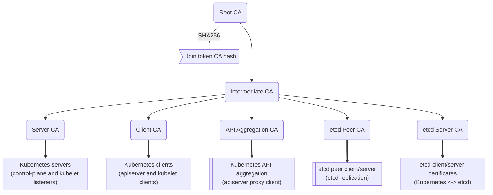
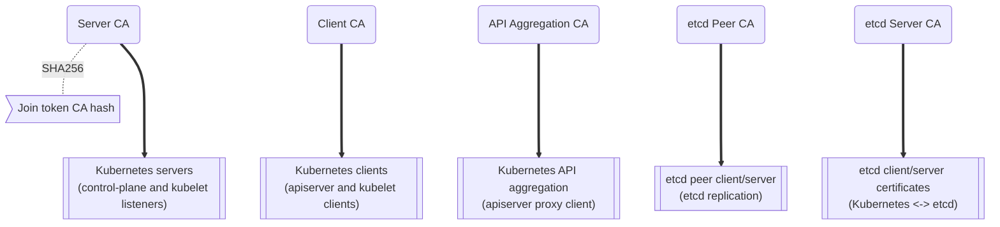
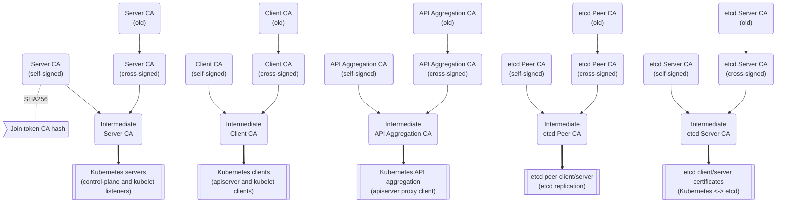

# k3s certificate

## 客户端和服务器证书

K3s 客户端和服务器证书自颁发日起 365 天内有效。每次启动 K3s 时，已过期或 90 天内过期的证书都会自动更新。

### 轮换客户端和服务器证书

要手动轮换客户端和服务器证书，请使用 `k3s certificate rotate` 子命令：

```bash
# 停止 K3s
systemctl stop k3s

# 轮换证书
k3s certificate rotate

# 启动 K3s
systemctl start k3s
```

你可以通过指定证书名称来轮换单个或多个证书：

```bash
k3s certificate rotate --service <SERVICE>,<SERVICE>
```

可以轮换的证书：`admin`、`api-server`、`controller-manager`、`scheduler`、`k3s-controller`, `k3s-server`, `cloud-controller`, `etcd`, `auth-proxy`, `kubelet`，`kube-proxy`。

## CA 证书

Kubernetes 需要大量 CA 证书才能正常运行。有关 Kubernetes 如何使用 CA 证书，请参阅 Kubernetes [PKI 证书和要求](https://kubernetes.io/docs/setup/best-practices/certificates/#all-certificates)文档。

默认情况下，K3s 在第一个 Server 节点启动时生成自签名 CA 证书。这些 CA 证书自颁发日起 10 年内有效，不会自动更新。

权威 CA 证书和密钥存储在数据存储区的引导程序密钥中，使用 [server token](token.md#server) 作为 PBKDF2 密码和 AES256-GCM 和 HMAC-SHA1 进行加密。
在 K3s Server 启动期间，CA 证书和密钥的副本会被提取到磁盘。
任何 Server 都可以在节点加入集群时为节点生成叶证书，而 Kubernetes [Certificates API](https://kubernetes.io/docs/reference/access-authn-authz/certificate-signing-requests/) 控制器可以在运行时颁发其他证书。

要轮换 CA 证书和密钥，请使用 `k3s certificate rotate-ca` 命令。
该命令会执行完整性检查，从而确认更新的证书和密钥可用。
如果更新后的数据没有问题，则会更新数据存储的加密引导程序密钥，并在下次 K3s 启动时使用新的证书和密钥。
如果在验证证书和密钥时出现了问题，则会向系统日志报告错误，并取消操作且不做任何更改。

:::info 版本
从 2023-02 版本（v1.26.2+k3s1、v1.25.7+k3s1、v1.24.11+k3s1、v1.23.17+k3s1）开始，支持 `k3s certificate rotate-ca` 命令以及使用由外部 CA 签发的 CA 证书。
:::

### 使用自定义 CA 证书

在集群中的第一台 Server 初始启动期间，如果找到了放置在正确位置的 CA 证书和密钥，将不会自动生成 CA 证书。

[K3s 仓库中的 `contrib/util/generate-custom-ca-certs.sh`](https://github.com/k3s-io/k3s/blob/master/contrib/util/generate-custom-ca-certs.sh) 示例脚本用于预先创建证书和密钥。
该脚本应在首次启动 K3s 之前运行，能创建一整套由通用根证书和中间 CA 证书签名的叶 CA 证书。
如果你已有根证书或中间 CA 证书，你可以使用此脚本（或用作起点）创建 CA 证书，从而使用现有机构中的 PKI 来配置 K3s 集群。

自定义证书颁发机构文件必须放在 `/var/lib/rancher/k3s/server/tls` 中。需要以下文件：
* `server-ca.crt`
* `server-ca.key`
* `client-ca.crt`
* `client-ca.key`
* `request-header-ca.crt`
* `request-header-ca.key`  
   *// 注意：即使未使用嵌入式 etcd，也需要 etcd 文件。*
* `etcd/peer-ca.crt`
* `etcd/peer-ca.key`
* `etcd/server-ca.crt`
* `etcd/server-ca.key`  
   *// 注意：这是用于签署 ServiceAccount Token 的私钥。它没有对应的证书。*
* `service.key`

#### 自定义 CA 拓扑

自定义 CA 证书应遵循以下拓扑结构：



#### 使用示例脚本

:::info 重要的
如果要使用示例脚本通过现有根 CA 来签发集群 CA 证书，则必须在运行脚本之前将根文件和中间文件放在目标目录中。
如果文件不存在，脚本将创建新的根 CA 证书和中间 CA 证书。
:::

如果你只想使用现有的根 CA 证书，请提供以下文件：
* `root-ca.pem`
* `root-ca.key`

要使用现有的根 CA 证书和中间 CA 证书，请提供以下文件：
* `root-ca.pem`
* `intermediate-ca.pem`
* `intermediate-ca.key`

要在启动 K3s 之前使用示例脚本生成自定义证书和密钥，请运行以下命令：
```bash
# 创建用于生成证书的目标目录。
mkdir -p /var/lib/rancher/k3s/server/tls

# 将根 CA 证书和中间 CA 证书 + 密钥复制到脚本的正确位置。
# 本示例假设你在 /etc/ssl 中放置了现有的根 CA 文件和中间 CA 文件。
# 如果你没有现有的根证书或中间 CA 证书，脚本将为你生成。
cp /etc/ssl/certs/root-ca.pem /etc/ssl/certs/intermediate-ca.pem /etc/ssl/private/intermediate-ca.key /var/lib/rancher/k3s/server/tls

# 生成自定义 CA 证书和密钥。
curl -sL https://github.com/k3s-io/k3s/raw/master/contrib/util/generate-custom-ca-certs.sh | bash -
```

如果命令成功完成，你可以进行 K3s 的首次安装和启动。
如果脚本生成了根 CA 文件或中间 CA 文件，你应该备份这些文件，这样，你就能在需要轮换 CA 证书时重新使用这些文件。

### 轮换自定义 CA 证书

要轮换自定义 CA 证书，请使用 `k3s certificate rotate-ca` 子命令。
更新后的文件必须暂存到一个临时目录中，加载到数据存储中，并且必须在所有节点上重启 K3s 才能使用更新后的证书。

:::warning
不要覆盖 `/var/lib/rancher/k3s/server/tls` 中正在使用的数据。  
将更新的证书和密钥暂存到单独的目录中。
:::

只要是使用相同的根 CA，使用自定义 CA 证书启动的集群能无中断地更新或轮换 CA 证书和密钥。

如果使用新的根 CA，则需要中断才能进行轮换。必须使用 `k3s certificate rotate-ca --force` 选项，所有使用 [secure token](token.md#secure) 加入的节点（包括 server）都需要重新配置才能使用新的 Token 值，并且 Pod 需要重启才能信任新的根 CA。

#### 使用示例脚本

上面的示例 `generate-custom-ca-certs.sh` 脚本也可用于在新的临时目录中生成更新的证书，这是通过将文件复制到正确的位置并设置 `DATA_DIR` 环境变量实现的。
要使用示例脚本生成更新的证书和密钥，请运行以下命令：
```bash
# 创建用于生成证书的临时目录。
mkdir -p /opt/k3s/server/tls

# 将根 CA 证书和中间 CA 证书 + 密钥复制到脚本的正确位置。
# 如果是非中断轮换，则需要用于生成原始证书的同一个根 CA。
# 如果原始文件仍在数据目录中，则可以运行：
cp /var/lib/rancher/k3s/server/tls/root-ca.* /var/lib/rancher/k3s/server/tls/intermediate-ca.* /opt/k3s/server/tls

# 复制当前的 service-account 签名密钥，这样，现有的 service-account token 就不会失效。
cp /var/lib/rancher/k3s/server/tls/service.key /opt/k3s/server/tls

# 生成更新的自定义 CA 证书和密钥。
curl -sL https://github.com/k3s-io/k3s/raw/master/contrib/util/generate-custom-ca-certs.sh | DATA_DIR=/opt/k3s bash -

# 将更新后的 CA 证书和密钥加载到数据存储中。
k3s certificate rotate-ca --path=/opt/k3s/server
```

如果 `rotate-ca` 命令返回错误，请检查服务日志中的错误。
命令成功完成，在集群中的所有节点上重启 K3s，你需要先重启 Server，然后再重启 Agent。

如果你使用了 `--force` 选项或更改了根 CA，请确保使用 [secure token](token.md#secure) 加入的节点在重启前都重新配置为使用新的 Token 值。
Token 可能存储在 `.env` 文件、systemd 单元或 config.yaml 中，具体取决于节点初始安装时的配置。

### 轮换自签名 CA 证书

要轮换 K3s 生成的自签名 CA 证书，请使用 `k3s certificate rotate-ca` 子命令。
更新后的文件必须暂存到一个临时目录中，加载到数据存储中，并且必须在所有节点上重启 K3s 才能使用更新后的证书。

:::warning
不要覆盖 `/var/lib/rancher/k3s/server/tls` 中正在使用的数据。  
将更新的证书和密钥暂存到单独的目录中。
:::

如果集群已使用默认的自签名 CA 证书启动，轮换将是中断的。使用 [secure token](token.md#secure) 加入的所有节点都需要重新配置才能信任新的 CA 哈希。
如果旧 CA 证书没有交叉签名新的 CA 证书，你需要使用 `--force` 选项来绕过完整性检查，并且需要重启 Pod 才能信任新的根 CA。

#### 默认 CA 拓扑
默认的自签名 CA 证书拓扑结构如下：



轮换默认的自签名 CA 时，你可以使用具有中间 CA 的修改后证书拓扑和由旧 CA 交叉签名的新根 CA，以便在新旧 CA 之间保留连续的信任链：


#### 使用示例脚本

[K3s 仓库中的 `contrib/util/rotate-default-ca-certs.sh`](https://github.com/k3s-io/k3s/blob/master/contrib/util/rotate-default-ca-certs.sh) 示例脚本用于创建由现有 CA 交叉签名的更新 CA 证书和密钥。

要使用示例脚本生成由现有 CA 交叉签名的更新的自签名证书，请运行以下命令：
```bash
# 创建更新的 CA 证书和密钥，由当前 CA 交叉签名。
# 该脚本将创建一个包含更新证书的新临时目录，并输出新的 Token 值。
curl -sL https://github.com/k3s-io/k3s/raw/master/contrib/util/rotate-default-ca-certs.sh | bash -

# 将更新后的证书加载到数据存储中。在脚本的输出中查看更新后的 Token 值。
k3s certificate rotate-ca --path=/var/lib/rancher/k3s/server/rotate-ca
```

如果 `rotate-ca` 命令返回错误，请检查服务日志中的错误。
命令成功完成，在集群中的所有节点上重启 K3s，你需要先重启 Server，然后再重启 Agent。

请确保使用 [secure token](token.md#secure) 加入的节点（包括 server 节点）在重启前都重新配置为使用新的 Token 值。
Token 可能存储在 `.env` 文件、systemd 单元或 config.yaml 中，具体取决于节点在初始安装时的配置。

## ServiceAccount Issuer 密钥轮换

service-account Issuer 密钥是用于签发 service-account Token 的 RSA 私钥。
轮换 service-account Issuer 密钥时，文件中至少应保留一个旧密钥，以免现有 service-account Token 失效。
它可以通过使用 `k3s certificate rotate-ca` 独立于集群 CA 进行轮换，这样能仅安装包含新旧密钥的更新的 `service.key` 文件。

:::warning
不要覆盖 `/var/lib/rancher/k3s/server/tls` 中正在使用的数据。  
将更新的密钥暂存到单独的目录中。
:::

例如，要仅轮换 service-account Issuer 密钥，请运行以下命令：
```bash
# 创建用于生成证书的临时目录
mkdir -p /opt/k3s/server/tls

# 检查 OpenSSL 版本
openssl version | grep -qF 'OpenSSL 3' && OPENSSL_GENRSA_FLAGS=-traditional

# 生成新的密钥
openssl genrsa ${OPENSSL_GENRSA_FLAGS:-} -out /opt/k3s/server/tls/service.key 2048

# 追加现有密钥，避免当前 token 失效
cat /var/lib/rancher/k3s/server/tls/service.key >> /opt/k3s/server/tls/service.key

# 将更新后的密钥加载到数据存储中
k3s certificate rotate-ca --path=/opt/k3s/server
```

出现文件未更新的警告是正常的。如果 `rotate-ca` 命令返回错误，请检查服务日志中的错误。
命令成功完成后，在集群中的所有 Server 上重启 K3s。无需重启 Agent 或任何 Pod。

